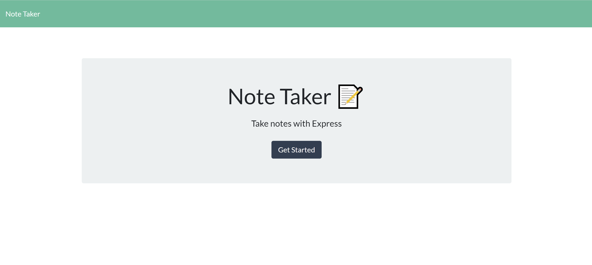
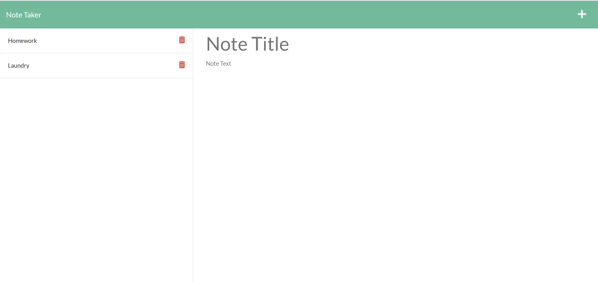

# note-taker

## Description

My motivation for creating this project was to practice back end development. This applicaiton solves the problem of keeping/saving notes or a todo list. During this project, I learned that backend development can be complicated but also very rewarding when you get the front & back hooked up.

## Table of Contents

- [Installation](#installation)
- [Usage](#usage)
- [License](#license)

## Installation

Here is the link to the Github repository where the repo can be cloned (https://github.com/bwalters8910/note-taker). Here is the link to the deployed application (https://note-taker-bw-2021.herokuapp.com/)

## Usage

To use this app, sipmly type in a note title, note body, then click the save button.

## License

[MIT](https://choosealicense.com/licenses/mit/)
